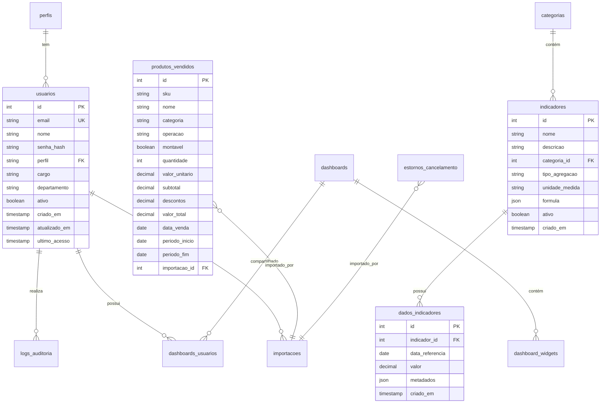

# Documentação do Banco de Dados 🗄️

## Índice
- [Visão Geral](#visão-geral)
- [Diagrama ER](#diagrama-er)
- [Tabelas](#tabelas)
- [Índices](#índices)
- [Functions e Triggers](#functions-e-triggers)
- [Segurança](#segurança)
- [Manutenção](#manutenção)

## Visão Geral

O banco de dados do Dashboard Auditoria FB utiliza PostgreSQL através do Supabase. A estrutura foi projetada para ser escalável, segura e otimizada para consultas analíticas.

### Características
- **ACID Compliant**: Transações atômicas e consistentes
- **Row Level Security (RLS)**: Segurança em nível de linha
- **Índices Otimizados**: Performance em consultas complexas
- **Normalização**: 3ª Forma Normal onde aplicável
- **Audit Trail**: Rastreamento completo de mudanças

## Diagrama ER



## Tabelas

### 1. usuarios

Armazena informações dos usuários do sistema.

```sql
CREATE TABLE usuarios (
    id SERIAL PRIMARY KEY,
    email VARCHAR(255) UNIQUE NOT NULL,
    nome VARCHAR(255) NOT NULL,
    senha_hash VARCHAR(255) NOT NULL,
    perfil VARCHAR(50) NOT NULL DEFAULT 'usuario',
    cargo VARCHAR(100),
    departamento VARCHAR(100),
    ativo BOOLEAN DEFAULT true,
    criado_em TIMESTAMP DEFAULT CURRENT_TIMESTAMP,
    atualizado_em TIMESTAMP DEFAULT CURRENT_TIMESTAMP,
    ultimo_acesso TIMESTAMP,
    CONSTRAINT chk_perfil CHECK (perfil IN ('admin', 'gestor', 'usuario'))
);

-- Comentários
COMMENT ON TABLE usuarios IS 'Tabela de usuários do sistema';
COMMENT ON COLUMN usuarios.perfil IS 'Perfil de acesso: admin, gestor ou usuario';
COMMENT ON COLUMN usuarios.senha_hash IS 'Senha criptografada com bcrypt';
```

### 2. categorias

Categorias para organização de indicadores.

```sql
CREATE TABLE categorias (
    id SERIAL PRIMARY KEY,
    nome VARCHAR(100) NOT NULL,
    descricao TEXT,
    icone VARCHAR(50),
    cor VARCHAR(7),
    ordem INTEGER DEFAULT 0,
    ativo BOOLEAN DEFAULT true,
    criado_em TIMESTAMP DEFAULT CURRENT_TIMESTAMP
);

-- Dados iniciais
INSERT INTO categorias (nome, descricao, icone, cor) VALUES
('Vendas', 'Indicadores de vendas e faturamento', 'fa-shopping-cart', '#4CAF50'),
('Operacional', 'Indicadores operacionais', 'fa-cogs', '#2196F3'),
('Financeiro', 'Indicadores financeiros', 'fa-dollar-sign', '#FF9800'),
('Qualidade', 'Indicadores de qualidade', 'fa-star', '#9C27B0');
```

### 3. indicadores

Definição dos indicadores (KPIs).

```sql
CREATE TABLE indicadores (
    id SERIAL PRIMARY KEY,
    nome VARCHAR(200) NOT NULL,
    descricao TEXT,
    categoria_id INTEGER REFERENCES categorias(id),
    tipo_agregacao VARCHAR(50) DEFAULT 'sum',
    unidade_medida VARCHAR(50),
    formula JSONB,
    meta_valor DECIMAL(15,2),
    meta_tipo VARCHAR(20),
    ativo BOOLEAN DEFAULT true,
    criado_em TIMESTAMP DEFAULT CURRENT_TIMESTAMP,
    atualizado_em TIMESTAMP DEFAULT CURRENT_TIMESTAMP,
    CONSTRAINT chk_tipo_agregacao CHECK (
        tipo_agregacao IN ('sum', 'avg', 'count', 'max', 'min', 'custom')
    ),
    CONSTRAINT chk_meta_tipo CHECK (
        meta_tipo IN ('maior_que', 'menor_que', 'igual_a', 'entre')
    )
);

-- Índices
CREATE INDEX idx_indicadores_categoria ON indicadores(categoria_id);
CREATE INDEX idx_indicadores_ativo ON indicadores(ativo);
```

### 4. dados_indicadores

Valores históricos dos indicadores.

```sql
CREATE TABLE dados_indicadores (
    id SERIAL PRIMARY KEY,
    indicador_id INTEGER NOT NULL REFERENCES indicadores(id),
    data_referencia DATE NOT NULL,
    valor DECIMAL(15,2) NOT NULL,
    valor_meta DECIMAL(15,2),
    metadados JSONB,
    importacao_id INTEGER REFERENCES importacoes(id),
    criado_em TIMESTAMP DEFAULT CURRENT_TIMESTAMP,
    CONSTRAINT uk_indicador_data UNIQUE(indicador_id, data_referencia)
);

-- Índices para performance
CREATE INDEX idx_dados_indicador_id ON dados_indicadores(indicador_id);
CREATE INDEX idx_dados_data_ref ON dados_indicadores(data_referencia);
CREATE INDEX idx_dados_indicador_data ON dados_indicadores(indicador_id, data_referencia DESC);
```

### 5. produtos_vendidos

Dados de vendas de produtos.

```sql
CREATE TABLE produtos_vendidos (
    id SERIAL PRIMARY KEY,
    sku VARCHAR(50),
    nome VARCHAR(255) NOT NULL,
    categoria VARCHAR(100),
    operacao VARCHAR(100),
    montavel BOOLEAN DEFAULT false,
    quantidade INTEGER NOT NULL DEFAULT 0,
    valor_unitario DECIMAL(15,2),
    subtotal DECIMAL(15,2),
    descontos DECIMAL(15,2) DEFAULT 0,
    valor_total DECIMAL(15,2) NOT NULL,
    data_venda DATE NOT NULL,
    periodo_inicio DATE,
    periodo_fim DATE,
    unidade VARCHAR(100),
    importacao_id INTEGER REFERENCES importacoes(id),
    criado_em TIMESTAMP DEFAULT CURRENT_TIMESTAMP
);

-- Índices compostos para queries comuns
CREATE INDEX idx_produtos_vendidos_data ON produtos_vendidos(data_venda);
CREATE INDEX idx_produtos_vendidos_categoria ON produtos_vendidos(categoria);
CREATE INDEX idx_produtos_vendidos_periodo ON produtos_vendidos(periodo_inicio, periodo_fim);
CREATE INDEX idx_produtos_vendidos_busca ON produtos_vendidos(nome, sku);
```

### 6. estornos_cancelamento

Registros de estornos e cancelamentos.

```sql
CREATE TABLE estornos_cancelamento (
    id SERIAL PRIMARY KEY,
    unidade VARCHAR(100) NOT NULL,
    squad VARCHAR(100) NOT NULL,
    ano INTEGER NOT NULL,
    data DATE NOT NULL,
    operacao VARCHAR(100) NOT NULL,
    situacao VARCHAR(100),
    quantidade INTEGER NOT NULL DEFAULT 0,
    total_atendimentos INTEGER NOT NULL DEFAULT 0,
    percentual DECIMAL(5,2),
    importacao_id INTEGER REFERENCES importacoes(id),
    criado_em TIMESTAMP DEFAULT CURRENT_TIMESTAMP
);

-- Índices otimizados
CREATE INDEX idx_estornos_unidade_data ON estornos_cancelamento(unidade, data);
CREATE INDEX idx_estornos_ano_data ON estornos_cancelamento(ano, data);
CREATE INDEX idx_estornos_operacao ON estornos_cancelamento(operacao);
```

### 7. importacoes

Controle de importações de dados.

```sql
CREATE TABLE importacoes (
    id SERIAL PRIMARY KEY,
    nome_arquivo VARCHAR(255) NOT NULL,
    tipo_arquivo VARCHAR(50),
    tamanho_bytes BIGINT,
    status VARCHAR(50) DEFAULT 'pendente',
    total_registros INTEGER,
    registros_importados INTEGER,
    registros_erro INTEGER,
    mensagem_erro TEXT,
    periodo_inicio DATE,
    periodo_fim DATE,
    metadados JSONB,
    usuario_id INTEGER REFERENCES usuarios(id),
    iniciado_em TIMESTAMP DEFAULT CURRENT_TIMESTAMP,
    finalizado_em TIMESTAMP,
    CONSTRAINT chk_status CHECK (
        status IN ('pendente', 'processando', 'concluido', 'erro', 'cancelado')
    )
);

-- Índice para buscar importações recentes
CREATE INDEX idx_importacoes_usuario_data ON importacoes(usuario_id, iniciado_em DESC);
```

### 8. logs_auditoria

Auditoria completa de ações no sistema.

```sql
CREATE TABLE logs_auditoria (
    id SERIAL PRIMARY KEY,
    usuario_id INTEGER REFERENCES usuarios(id),
    acao VARCHAR(100) NOT NULL,
    tabela VARCHAR(100),
    registro_id INTEGER,
    dados_anteriores JSONB,
    dados_novos JSONB,
    ip_address INET,
    user_agent TEXT,
    criado_em TIMESTAMP DEFAULT CURRENT_TIMESTAMP
);

-- Índices para consultas de auditoria
CREATE INDEX idx_logs_usuario ON logs_auditoria(usuario_id);
CREATE INDEX idx_logs_acao ON logs_auditoria(acao);
CREATE INDEX idx_logs_tabela_registro ON logs_auditoria(tabela, registro_id);
CREATE INDEX idx_logs_data ON logs_auditoria(criado_em DESC);

-- Particionamento por mês (PostgreSQL 12+)
-- CREATE TABLE logs_auditoria_2024_01 PARTITION OF logs_auditoria
-- FOR VALUES FROM ('2024-01-01') TO ('2024-02-01');
```

### 9. configuracoes

Parâmetros do sistema.

```sql
CREATE TABLE configuracoes (
    chave VARCHAR(100) PRIMARY KEY,
    valor TEXT NOT NULL,
    tipo VARCHAR(50) DEFAULT 'string',
    descricao TEXT,
    editavel BOOLEAN DEFAULT true,
    atualizado_em TIMESTAMP DEFAULT CURRENT_TIMESTAMP,
    atualizado_por INTEGER REFERENCES usuarios(id)
);

-- Configurações padrão
INSERT INTO configuracoes (chave, valor, tipo, descricao) VALUES
('tema_padrao', 'clean', 'string', 'Tema padrão do dashboard'),
('limite_upload_mb', '16', 'integer', 'Tamanho máximo de upload em MB'),
('dias_retencao_logs', '90', 'integer', 'Dias para manter logs de auditoria'),
('formato_data', 'DD/MM/YYYY', 'string', 'Formato de exibição de datas');
```

### 10. dashboards

Dashboards customizados.

```sql
CREATE TABLE dashboards (
    id SERIAL PRIMARY KEY,
    nome VARCHAR(200) NOT NULL,
    descricao TEXT,
    tipo VARCHAR(50) DEFAULT 'custom',
    configuracao JSONB NOT NULL,
    publico BOOLEAN DEFAULT false,
    criado_por INTEGER REFERENCES usuarios(id),
    criado_em TIMESTAMP DEFAULT CURRENT_TIMESTAMP,
    atualizado_em TIMESTAMP DEFAULT CURRENT_TIMESTAMP
);

CREATE TABLE dashboards_usuarios (
    dashboard_id INTEGER REFERENCES dashboards(id) ON DELETE CASCADE,
    usuario_id INTEGER REFERENCES usuarios(id) ON DELETE CASCADE,
    permissao VARCHAR(50) DEFAULT 'visualizar',
    favorito BOOLEAN DEFAULT false,
    PRIMARY KEY (dashboard_id, usuario_id)
);

CREATE TABLE dashboard_widgets (
    id SERIAL PRIMARY KEY,
    dashboard_id INTEGER REFERENCES dashboards(id) ON DELETE CASCADE,
    tipo VARCHAR(100) NOT NULL,
    titulo VARCHAR(200),
    configuracao JSONB NOT NULL,
    posicao_x INTEGER DEFAULT 0,
    posicao_y INTEGER DEFAULT 0,
    largura INTEGER DEFAULT 6,
    altura INTEGER DEFAULT 4,
    ordem INTEGER DEFAULT 0
);
```

## Índices

### Índices de Performance

```sql
-- Índices para queries mais comuns
CREATE INDEX idx_produtos_vendidos_busca_completa 
ON produtos_vendidos(data_venda, categoria, unidade);

CREATE INDEX idx_estornos_busca_completa 
ON estornos_cancelamento(data, unidade, operacao);

-- Índices parciais para dados ativos
CREATE INDEX idx_usuarios_ativos ON usuarios(email) WHERE ativo = true;
CREATE INDEX idx_indicadores_ativos ON indicadores(categoria_id) WHERE ativo = true;

-- Índices de texto para busca
CREATE INDEX idx_produtos_nome_gin ON produtos_vendidos USING gin(nome gin_trgm_ops);
CREATE INDEX idx_usuarios_nome_gin ON usuarios USING gin(nome gin_trgm_ops);
```

## Functions e Triggers

### 1. Atualizar timestamp

```sql
CREATE OR REPLACE FUNCTION update_updated_at_column()
RETURNS TRIGGER AS $$
BEGIN
    NEW.atualizado_em = CURRENT_TIMESTAMP;
    RETURN NEW;
END;
$$ language 'plpgsql';

-- Aplicar trigger em tabelas relevantes
CREATE TRIGGER update_usuarios_updated_at BEFORE UPDATE ON usuarios
    FOR EACH ROW EXECUTE FUNCTION update_updated_at_column();

CREATE TRIGGER update_indicadores_updated_at BEFORE UPDATE ON indicadores
    FOR EACH ROW EXECUTE FUNCTION update_updated_at_column();
```

### 2. Calcular percentual automaticamente

```sql
CREATE OR REPLACE FUNCTION calcular_percentual_estorno()
RETURNS TRIGGER AS $$
BEGIN
    IF NEW.total_atendimentos > 0 THEN
        NEW.percentual = (NEW.quantidade::DECIMAL / NEW.total_atendimentos) * 100;
    ELSE
        NEW.percentual = 0;
    END IF;
    RETURN NEW;
END;
$$ LANGUAGE plpgsql;

CREATE TRIGGER trigger_calcular_percentual
BEFORE INSERT OR UPDATE ON estornos_cancelamento
FOR EACH ROW EXECUTE FUNCTION calcular_percentual_estorno();
```

### 3. Agregação de indicadores

```sql
CREATE OR REPLACE FUNCTION calcular_indicador_periodo(
    p_indicador_id INTEGER,
    p_data_inicio DATE,
    p_data_fim DATE
) RETURNS TABLE(
    periodo DATE,
    valor DECIMAL,
    valor_meta DECIMAL
) AS $$
BEGIN
    RETURN QUERY
    SELECT 
        data_referencia as periodo,
        SUM(d.valor) as valor,
        AVG(d.valor_meta) as valor_meta
    FROM dados_indicadores d
    WHERE d.indicador_id = p_indicador_id
        AND d.data_referencia BETWEEN p_data_inicio AND p_data_fim
    GROUP BY data_referencia
    ORDER BY data_referencia;
END;
$$ LANGUAGE plpgsql;
```

## Segurança

### Row Level Security (RLS)

```sql
-- Habilitar RLS
ALTER TABLE usuarios ENABLE ROW LEVEL SECURITY;
ALTER TABLE dados_indicadores ENABLE ROW LEVEL SECURITY;
ALTER TABLE logs_auditoria ENABLE ROW LEVEL SECURITY;

-- Políticas para usuarios
CREATE POLICY usuarios_select_policy ON usuarios
    FOR SELECT
    TO authenticated
    USING (
        auth.uid() = id OR
        EXISTS (
            SELECT 1 FROM usuarios u
            WHERE u.id = auth.uid() AND u.perfil = 'admin'
        )
    );

CREATE POLICY usuarios_update_policy ON usuarios
    FOR UPDATE
    TO authenticated
    USING (auth.uid() = id)
    WITH CHECK (auth.uid() = id);

-- Políticas para dados_indicadores
CREATE POLICY dados_indicadores_select_policy ON dados_indicadores
    FOR SELECT
    TO authenticated
    USING (true); -- Todos podem ver indicadores

CREATE POLICY dados_indicadores_insert_policy ON dados_indicadores
    FOR INSERT
    TO authenticated
    WITH CHECK (
        EXISTS (
            SELECT 1 FROM usuarios u
            WHERE u.id = auth.uid() AND u.perfil IN ('admin', 'gestor')
        )
    );
```

### Roles e Permissões

```sql
-- Criar roles
CREATE ROLE dashboard_admin;
CREATE ROLE dashboard_gestor;
CREATE ROLE dashboard_usuario;

-- Permissões para admin
GRANT ALL ON ALL TABLES IN SCHEMA public TO dashboard_admin;
GRANT ALL ON ALL SEQUENCES IN SCHEMA public TO dashboard_admin;

-- Permissões para gestor
GRANT SELECT, INSERT, UPDATE ON 
    produtos_vendidos, estornos_cancelamento, dados_indicadores 
TO dashboard_gestor;
GRANT SELECT ON usuarios, categorias, indicadores TO dashboard_gestor;

-- Permissões para usuario
GRANT SELECT ON 
    produtos_vendidos, estornos_cancelamento, dados_indicadores,
    categorias, indicadores 
TO dashboard_usuario;
```

## Manutenção

### Backup

```sql
-- Backup completo
pg_dump -h localhost -U postgres -d dashboard_fb > backup_$(date +%Y%m%d).sql

-- Backup apenas estrutura
pg_dump -h localhost -U postgres -d dashboard_fb --schema-only > schema.sql

-- Backup apenas dados
pg_dump -h localhost -U postgres -d dashboard_fb --data-only > data.sql
```

### Vacuum e Analyze

```sql
-- Manutenção regular
VACUUM ANALYZE produtos_vendidos;
VACUUM ANALYZE estornos_cancelamento;
VACUUM ANALYZE dados_indicadores;

-- Reindex
REINDEX TABLE produtos_vendidos;
REINDEX TABLE estornos_cancelamento;
```

### Monitoramento

```sql
-- Queries lentas
SELECT 
    query,
    calls,
    total_time,
    mean_time,
    max_time
FROM pg_stat_statements
WHERE mean_time > 100
ORDER BY mean_time DESC
LIMIT 10;

-- Tamanho das tabelas
SELECT
    schemaname,
    tablename,
    pg_size_pretty(pg_total_relation_size(tablename::regclass)) as size
FROM pg_tables
WHERE schemaname = 'public'
ORDER BY pg_total_relation_size(tablename::regclass) DESC;

-- Índices não utilizados
SELECT
    schemaname,
    tablename,
    indexname,
    idx_scan
FROM pg_stat_user_indexes
WHERE idx_scan = 0
AND indexname NOT LIKE 'pk_%';
```

### Limpeza de Dados Antigos

```sql
-- Limpar logs antigos
DELETE FROM logs_auditoria 
WHERE criado_em < CURRENT_DATE - INTERVAL '90 days';

-- Arquivar importações antigas
INSERT INTO importacoes_arquivo 
SELECT * FROM importacoes 
WHERE finalizado_em < CURRENT_DATE - INTERVAL '1 year';

DELETE FROM importacoes 
WHERE finalizado_em < CURRENT_DATE - INTERVAL '1 year';
```

## Otimizações

### Particionamento

```sql
-- Particionar logs por mês
CREATE TABLE logs_auditoria_2024_01 PARTITION OF logs_auditoria
FOR VALUES FROM ('2024-01-01') TO ('2024-02-01');

CREATE TABLE logs_auditoria_2024_02 PARTITION OF logs_auditoria
FOR VALUES FROM ('2024-02-01') TO ('2024-03-01');
```

### Materialized Views

```sql
-- View materializada para dashboard principal
CREATE MATERIALIZED VIEW mv_dashboard_summary AS
SELECT 
    DATE_TRUNC('day', data_venda) as data,
    COUNT(DISTINCT id) as total_vendas,
    SUM(valor_total) as valor_total,
    AVG(valor_total) as ticket_medio,
    COUNT(DISTINCT categoria) as categorias_ativas
FROM produtos_vendidos
WHERE data_venda >= CURRENT_DATE - INTERVAL '30 days'
GROUP BY DATE_TRUNC('day', data_venda);

-- Refresh automático
CREATE OR REPLACE FUNCTION refresh_dashboard_summary()
RETURNS void AS $$
BEGIN
    REFRESH MATERIALIZED VIEW CONCURRENTLY mv_dashboard_summary;
END;
$$ LANGUAGE plpgsql;
```

---

Para mais informações sobre PostgreSQL e Supabase, consulte:
- [PostgreSQL Documentation](https://www.postgresql.org/docs/)
- [Supabase Documentation](https://supabase.com/docs)